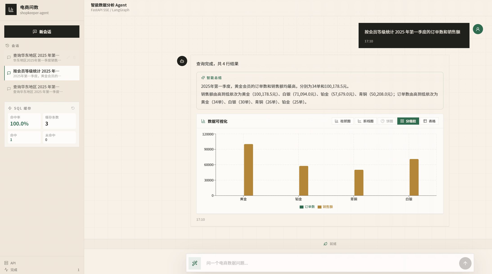
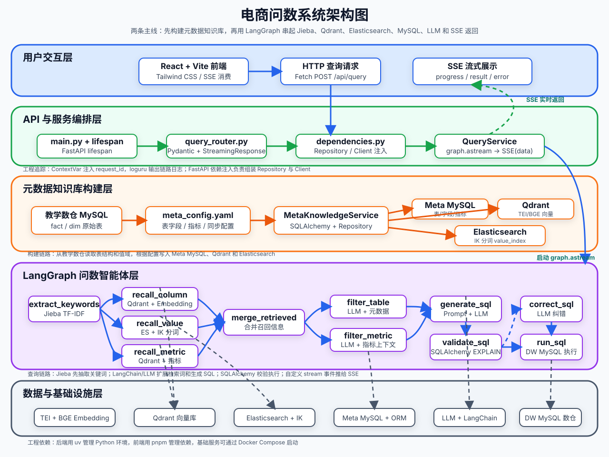
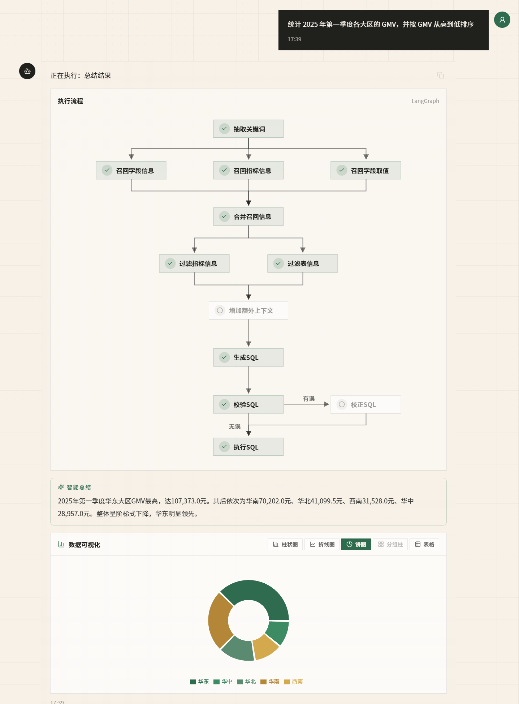

<div align='center'>
  <h1 style="margin-top: 15px;">「电商问数」智能数据分析 Agent</h1>
  <h4><b>shopkeeper-agent · 优化增强版</b></h4>
  <p><em>面向真实电商问数场景的 Text-to-SQL 智能体：覆盖 SQL 安全审计、向量缓存、多轮会话管理、图表可视化与自然语言总结，从召回、生成到执行形成可控的安全闭环</em></p>
</div>

<div align='center'>


</div>

**📢 项目定位**：面向真实电商问数场景的 LangGraph 智能体，在「召回 → 生成 → 执行」主链路之外，补齐了 SQL 安全审计、向量缓存、多轮会话管理、结果可视化、自然语言总结与工作流安全闭环等 6 项工程能力，形成可落地、可观测、可演进的生产级向架构。




---

## 📖 项目介绍

在真实问数场景里，业务同学通常不会写 SQL，数据分析同学也很难随时记住所有表结构、字段含义、指标口径和字段取值。单纯把自然语言问题直接交给大模型，很容易出现表选错、字段选错、指标理解错和 SQL 幻觉等问题。

`电商问数` 要解决的就是这个问题：

- 用户用自然语言提问
- 系统自动召回相关字段、指标和字段取值
- 大模型基于上下文进行分步推理
- 生成 SQL 并**经过安全审计**后查询数据仓库
- 以**图表 + 自然语言结论**的方式流式返回分析结果
- 支持**多轮追问**，自动基于会话历史改写模糊查询

---

## ✨ 项目亮点

### 核心问数能力

- **检索 + 推理 + 生成，而不是模型直出 SQL**
    - 先围绕问题召回相关字段、指标和值域，再组织上下文生成 SQL，整体链路更稳、更可控。
- **面向企业问数场景的混合检索**
    - `Qdrant` 负责字段和指标的语义召回。
    - `Elasticsearch` 负责字段取值的全文检索。
    - `MySQL` 负责保存完整、权威的结构化元数据。
- **支持字段、指标、取值三类信息协同召回**
    - 比单纯做表级或字段级检索更贴近真实企业分析流程。
- **从检索到执行的完整可运行链路**
    - 不停留在 Prompt 设计，而是会真实生成 SQL、执行查询，并以流式方式返回结果。
- **工程化后端结构清晰**
    - 基于 `FastAPI + LangGraph + Repository + Client Manager` 组织配置、客户端、仓储层、服务层与智能体流程，便于维护和扩展。

### 🚀 6 大工程能力

| # | 模块 | 解决的问题 | 核心设计 | 详细文档 |
|---|------|------------|----------|----------|
| 1 | **SQL 安全审计层** | LLM 可能生成 DDL / DML / 危险函数 / 系统库查询 | `sqlglot` AST 静态分析 + 表白名单 + 危险函数拦截 + 自动 LIMIT 注入，纯内存 <3ms 完成审计 | [📖 Wiki](docs/wiki/README_sql-safety.md) |
| 2 | **SQL 向量缓存** | 相似/重复问题每次都重走 LLM，浪费 token 且延迟高 | Redis 存储查询 embedding + 结果，余弦相似度模糊命中，响应从秒级降到 ~50ms | [📖 Wiki](docs/wiki/README_sql-cache.md) |
| 3 | **多轮对话与会话管理** | 追问如「那华东呢」脱离上下文无法理解；刷新后对话丢失 | MySQL 持久化 session / session_turn + LangGraph MemorySaver + LLM Query Rewriting，懒创建不空会话 | [📖 Wiki](docs/wiki/README_multi-turn-session.md) |
| 4 | **结果图表可视化** | 业务同学看表格读数效率低，需要一眼看结论 | Recharts 自动识别维度/指标/时间维度，推荐柱/折/饼图，支持手动切换，不适合时降级表格 | [📖 Wiki](docs/wiki/README_chart-visualization.md) |
| 5 | **自然语言总结** | 结果出来还得读表，不直观；需要一句中文结论 | `summarize_result` 节点流式 SSE 逐 token 推送，≤3 句不编造数字，失败自动降级 | [📖 Wiki](docs/wiki/README_nl-summary.md) |
| 6 | **工作流安全闭环** | 原 correct_sql → run_sql 跳过重校验，有安全风险；极端情况图可能死循环 | 重构为 sql_safety ↔ correct_sql ↔ validate_sql 双循环，+ recursion_limit=25 兜底 | [📖 Wiki](docs/wiki/README_workflow-optimization.md) |

---

## 🏗️ 系统架构



项目围绕两条主线展开：

| 主线             | 做什么                                                                   | 涉及模块                                     |
| ---------------- | ------------------------------------------------------------------------ | -------------------------------------------- |
| 元数据知识库构建 | 抽取业务数仓中的表、字段、指标和字段取值，写入结构化库、向量库和全文索引 | `MySQL` / `Qdrant` / `Elasticsearch` / `TEI` |
| 自然语言问数     | 基于用户问题完成召回、上下文整理、SQL 生成校验执行，并把过程流式返回前端 | `LangGraph` / `FastAPI` / `SSE` / `React`    |

### 工作流闭环（LangGraph 节点图）

```
START → extract_keywords → 三路召回(字段/取值/指标) → merge → 过滤(表+指标)
      → add_extra_context → generate_sql
      → sql_safety_check ─┬─通过─→ validate_sql ─┬─通过─→ run_sql → summarize_result → END
                          │                      │
                          │                 失败→ correct_sql
                          失败未超限──────────────┘
                          (失败超限 → END，retry_count 控制)
```

> recursion_limit=25 硬兜底，防止死循环；MemorySaver 按 thread_id=session_id 隔离检查点。



---

## 🛠️ 项目技术栈

| 模块       | 技术                              | 作用                                           |
| ---------- | --------------------------------- | ---------------------------------------------- |
| 业务数仓   | `MySQL`                           | 模拟事实表、维度表和分析型查询环境             |
| 元数据库   | `MySQL` / `SQLAlchemy`            | 保存表、字段、指标、字段指标关系、会话历史等   |
| 向量检索   | `Qdrant`                          | 保存字段和指标向量，支持语义召回               |
| 全文检索   | `Elasticsearch`                   | 保存字段真实取值，支持关键词和值域检索         |
| Embedding  | `TEI` / `BAAI/bge-large-zh-v1.5`  | 将字段、指标、问题等文本转成向量               |
| 智能体编排 | `LangGraph`                       | 组织多阶段问数工作流 + MemorySaver 会话检查点  |
| 模型接入   | `LangChain`                       | 封装 LLM 与 Embedding 调用                     |
| 后端接口   | `FastAPI`                         | 提供问数 API、会话 API、缓存 API、依赖注入     |
| 流式协议   | `SSE`                             | 实时返回进度 / 结果 / 总结 / 错误消息          |
| 前端       | `React` / `Vite` / `Tailwind CSS` | 聊天式问数界面 + 会话列表 + 缓存面板           |
| 图表       | `Recharts`                        | 结果可视化：柱 / 折 / 饼 / 分组柱              |
| SQL 审计   | `sqlglot`                         | AST 静态分析、表白名单、函数拦截、LIMIT 注入   |
| 缓存       | `Redis` + 向量余弦相似度          | SQL 结果模糊命中，节省 token、降低延迟         |
| 日志追踪   | `ContextVar` / `loguru`           | 为并发请求注入 request_id，便于排查链路        |
| 依赖管理   | `uv` / `pnpm`                     | 管理 Python 后端和前端依赖                     |

---

## 📁 项目结构

```text
shopkeeper-agent/
├── app/
│   ├── agent/            # LangGraph 图、状态、上下文和各类节点
│   │   ├── nodes/        #   · sql_safety_check（新增）
│   │   │                 #   · summarize_result（新增）
│   │   ├── graph.py      #   · 重构后的安全闭环 + MemorySaver
│   │   └── state.py      #   · 新增 session_id / retry_count / summary
│   ├── api/              # FastAPI 路由、依赖注入、生命周期
│   │   ├── routers/
│   │   │   ├── cache_router.py      # 新增：缓存统计/重置接口
│   │   │   └── session_router.py    # 新增：会话 CRUD + 历史接口
│   ├── clients/          # MySQL、Qdrant、ES、Embedding、Redis 客户端管理
│   ├── conf/             # 配置 dataclass：新增 SessionConfig / SummaryConfig / SqlSafetyConfig
│   ├── core/             # 日志、request_id、sql_safety 审计器
│   ├── entities/         # 业务对象：新增 Session / SessionTurn / SQLCacheEntry
│   ├── models/           # SQLAlchemy ORM：新增 session / session_turn 表
│   ├── prompt/           # Prompt 加载工具
│   ├── repositories/     # MySQL / Qdrant / ES 数据访问层
│   │   └── mysql/meta/
│   │       └── session_mysql_repository.py  # 新增：MySQL 会话持久化
│   ├── scripts/          # 元数据知识库构建脚本
│   └── services/         # 业务服务
│       ├── query_service.py       # 增强：_rewrite_query + _try_cache + _record_turn
│       ├── session_service.py     # 新增：多轮会话管理
│       └── sql_cache_service.py   # 新增：SQL 向量缓存服务
├── conf/                 # app_config.yaml + meta_config.yaml（新增配置项）
├── docker/               # Docker Compose、MySQL 初始化 SQL、ES 插件
├── docs/
│   ├── images/           # README 插图
│   └── wiki/             # 📖 新增：各优化模块详细设计文档
│       ├── README_sql-safety.md
│       ├── README_sql-cache.md
│       ├── README_multi-turn-session.md
│       ├── README_chart-visualization.md
│       ├── README_nl-summary.md
│       └── README_workflow-optimization.md
├── frontend/             # React + Vite + Tailwind CSS 前端
│   └── src/
│       ├── components/
│       │   ├── ResultChart.tsx       # 新增：结果图表组件
│       │   ├── SessionList.tsx       # 新增：会话列表侧边栏
│       │   └── MessageBubble.tsx     # 增强：总结区 + ResultChart 集成
│       ├── lib/
│       │   ├── chartTypeDetector.ts  # 新增：图表类型自动检测工具
│       │   ├── sessionApi.ts         # 新增：会话 API 封装
│       │   └── sessionStorage.ts     # 新增：localStorage 会话缓存
│       ├── types/
│       │   ├── agent.ts              # 新增：SummaryEvent / CacheHit 类型
│       │   └── session.ts            # 新增：Session 类型
│       └── App.tsx                   # 增强：会话状态 + 缓存统计面板
├── prompts/              # SQL 生成、修正、过滤等 Prompt 模板
│   ├── rewrite_query.prompt          # 新增：多轮问题改写
│   └── summarize_result.prompt       # 新增：结果总结
├── tests/
│   └── test_sql_safety.py            # 新增：SQL 安全审计单元测试
├── main.py               # FastAPI 应用入口（注册 session_router + cache_router）
└── pyproject.toml        # Python 项目依赖（新增 sqlglot / redis）
```

---

## 🚀 快速开始

当前仓库已经包含一套可直接启动的本地开发环境，你可以按照以下顺序启动项目。

### 1. 准备环境

- Python `>= 3.14`
- `uv`
- Docker 与 Docker Compose
- Node.js 与 `pnpm`

### 2. 克隆项目

```bash
git clone https://github.com/didilili/shopkeeper-agent.git
cd shopkeeper-agent
```

### 3. 安装后端依赖

```bash
uv sync
```

### 4. 配置大模型 API Key

```bash
cp .env.example .env
```

把 `.env` 中的 `LLM_API_KEY` 替换成真实密钥：

```bash
LLM_API_KEY=your_real_api_key
```

默认配置使用兼容 OpenAI 接口的硅基流动服务：

```yaml
llm:
    model_name: Pro/zai-org/GLM-5.1
    api_key: ${oc.env:LLM_API_KEY}
    base_url: https://api.siliconflow.cn/v1
```

如需使用其他兼容 OpenAI API 的模型平台，修改 [conf/app_config.yaml](conf/app_config.yaml) 中的 `model_name` 和 `base_url`。

### 5. （可选）开启自然语言总结

默认关闭以节省 token。如需开启：

```yaml
# conf/app_config.yaml
summary:
    enable: true   # 改为 true
```

### 6. 准备 Embedding 模型

项目通过 `TEI` 加载 `BAAI/bge-large-zh-v1.5`。模型文件体积较大，无法在仓库中进行提交，需要先下载到 Docker 挂载目录：

```bash
uv run hf download BAAI/bge-large-zh-v1.5 --local-dir docker/embedding/bge-large-zh-v1.5
```

如果手动下载，请解压到：`docker/embedding/bge-large-zh-v1.5`路径下。

### 7. 启动 Docker 基础服务

```bash
docker compose -f docker/docker-compose.yaml up -d
```

默认端口：

| 服务          | 端口   |
| ------------- | ------ |
| MySQL         | `3306` |
| Elasticsearch | `9200` |
| Kibana        | `5601` |
| Qdrant        | `6333` |
| Redis         | `6379` |
| Embedding     | `8081` |

> `docker/mysql/meta.sql` 和 `docker/mysql/dw.sql` 会在 MySQL 容器首次启动时自动初始化元数据库、业务数仓、以及 `session` / `session_turn` 等新增表。

### 8. 构建元数据知识库

```bash
uv run python -m app.scripts.build_meta_knowledge -c conf/meta_config.yaml
```

这一步会把表字段元数据写入 MySQL，把字段和指标向量写入 Qdrant，并把字段真实取值写入 Elasticsearch。

### 9. 启动后端

```bash
uv run fastapi dev main.py
```

后端接口：

```text
POST   http://127.0.0.1:8000/api/query            # 问数主接口（SSE 流式）
GET    http://127.0.0.1:8000/api/sessions          # 会话列表
POST   http://127.0.0.1:8000/api/sessions          # 新建会话
PATCH  http://127.0.0.1:8000/api/sessions/{id}     # 重命名会话
DELETE http://127.0.0.1:8000/api/sessions/{id}     # 删除会话
GET    http://127.0.0.1:8000/api/sessions/{id}/messages  # 会话轮次历史
GET    http://127.0.0.1:8000/api/cache/stats       # SQL 缓存命中率统计
POST   http://127.0.0.1:8000/api/cache/stats/reset # 重置缓存统计
```

问数请求示例：

```json
{
    "query": "统计华北地区的销售总额",
    "session_id": "optional-uuid-for-multi-turn"
}
```

SSE 消息类型：

| 类型       | 子状态                  | 含义                     |
| ---------- | ----------------------- | ------------------------ |
| `progress` | `running` / `success` / `error` | 节点执行进度 / cache_hit |
| `result`   | -                       | 最终查询结果（含 SQL）   |
| `summary`  | `start` / `streaming` / `done` / `error` | 自然语言总结流式输出 |
| `error`    | -                       | 全局异常消息             |

### 10. 启动前端

```bash
cd frontend
pnpm install
pnpm dev
```

前端默认通过 Vite 代理把 `/api` 转发到 `http://127.0.0.1:8000`。如需修改：

```bash
cd frontend
cp .env.example .env
```

```bash
VITE_DEV_PROXY_TARGET=http://127.0.0.1:8000
```

---


`main` 分支保留当前完整闭环版本（含所有优化增强）。

---

## 📖 Wiki 文档索引（优化增强功能）

每个优化模块的详细设计文档、坑点记录和配置说明：

| 文档 | 内容概览 |
|------|----------|
| [SQL 安全审计层](docs/wiki/README_sql-safety.md) | 8 项检查清单、表白名单 + 系统库拦截、AST LIMIT 注入、CTE 别名处理、sqlglot 函数名提取坑 |
| [SQL 向量缓存](docs/wiki/README_sql-cache.md) | Redis 存储结构、余弦相似度实现、与多轮会话协作、前端缓存统计面板 |
| [多轮对话与会话管理](docs/wiki/README_multi-turn-session.md) | Query Rewriting Prompt 设计、MySQL 表结构、LangGraph MemorySaver + thread_id、懒创建策略、localStorage 双层缓存、flush vs commit 坑 |
| [结果图表可视化](docs/wiki/README_chart-visualization.md) | 列角色识别算法（维度/指标/时间维度）、图表推荐逻辑、Recharts 样式与 Tailwind 融合、表格 Tab 集成方案、优雅降级 |
| [自然语言总结](docs/wiki/README_nl-summary.md) | SSE summary 事件协议、Prompt 三句硬约束、5 种降级场景、前端打字机效果、与会话摘要联动 |
| [LangGraph 工作流优化](docs/wiki/README_workflow-optimization.md) | 原循环漏洞分析、sql_safety ↔ correct_sql ↔ validate_sql 双循环重构、recursion_limit 兜底、correct_sql 必须清空 error、State 新增字段 |

---

## 🚧 能力边界与演进方向

面向生产部署，系统当前能力边界与后续演进方向如下：

| 能力项 | 当前状态 | 说明 |
|-----------|-----------|------|
| 用户登录、角色权限和数据权限控制 | ❌ 未实现 | 仍需扩展：接入 OAuth/OIDC，按用户 / 角色维度对表白名单和查询结果做行级过滤 |
| 多租户隔离 | ❌ 未实现 | 需在 Meta 层加 tenant_id 外键，仓储层统一注入过滤条件 |
| **SQL 安全审计和执行白名单** | ✅ **已实现** | 见 [SQL 安全审计层 Wiki](docs/wiki/README_sql-safety.md) |
| **查询缓存、限流和性能治理** | ⚠️ **部分实现** | Redis 向量缓存已上线；限流（令牌桶/滑动窗口）和慢查询告警仍需扩展 |
| 系统化评测集与自动化回归评测 | ⚠️ 基础框架可延伸 | 评测数据构建可复用 `sql_safety` 单测模板，端到端回归建议配合 worktree 的 eval-set 分支 |
| **更复杂的多轮问数记忆、追问改写和会话管理** | ✅ **已实现** | 见 [多轮对话 Wiki](docs/wiki/README_multi-turn-session.md) |
| 监控告警、链路追踪平台和灰度发布 | ❌ 未实现 | 建议接入 Prometheus + Grafana（QPS / 缓存命中率 / LLM 延迟），OpenTelemetry 链路追踪 |

以上能力边界与设计取舍均记录在 `docs/wiki/` 各模块文档中，便于后续按演进方向逐步补齐。
